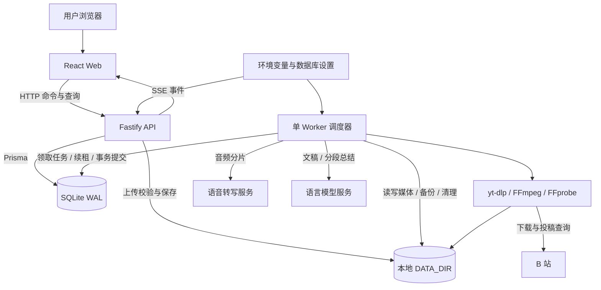
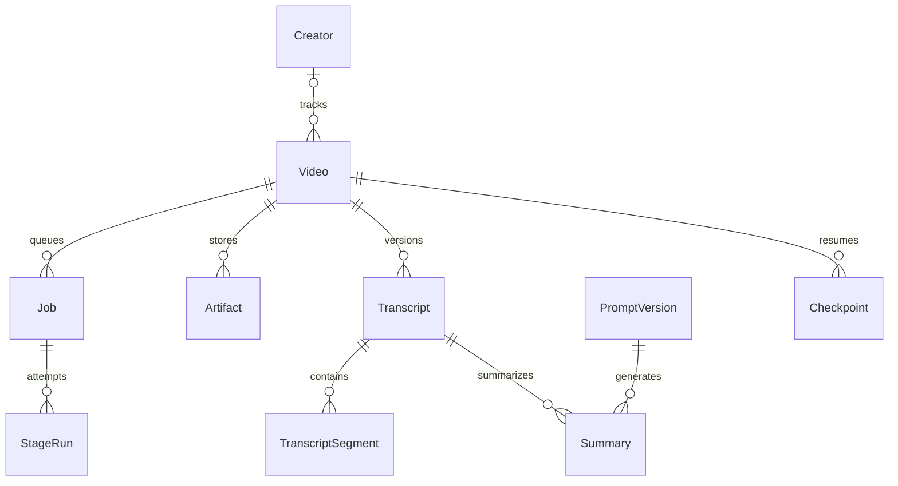
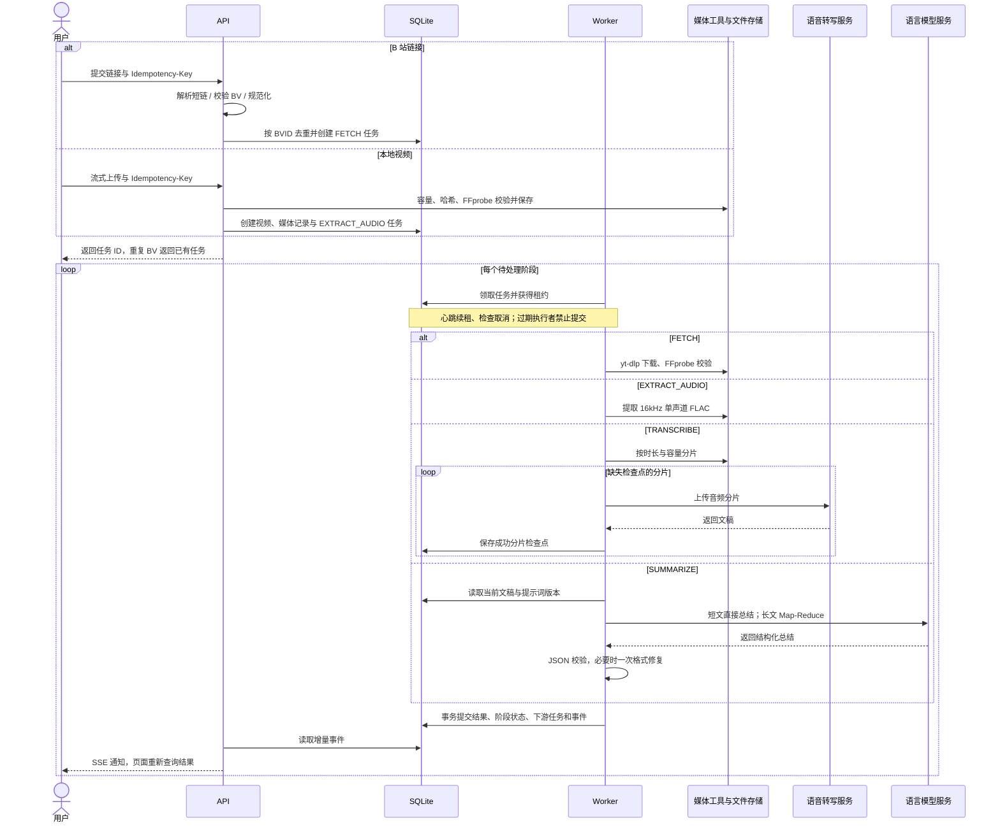
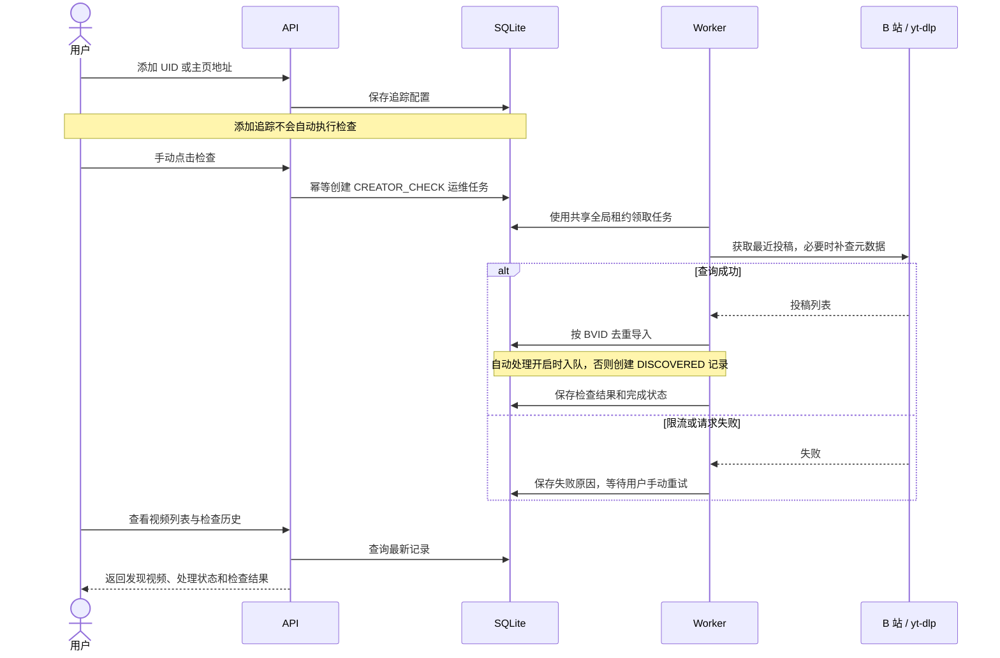

# 帧语 FrameNote

**把视频变成可检索、可回顾的文字笔记。** 帧语 FrameNote 是一个面向个人的本地视频知识整理工具：导入 B 站视频或本地文件，自动提取音频、转写文稿并生成结构化 AI 总结，支持历史版本、UP 主手动追踪和 Excel 导出。

[](LICENSE)
[](package.json)
[](package.json)

项目仓库：[zrh-chill/videoassist](https://github.com/zrh-chill/videoassist)。当前版本为 **0.1.0**，已实现视频处理、设置、导出、追踪与数据维护；真实 UP 主检查成功闭环仍待外部复验，详见[当前边界](#当前边界)。

> 应用服务和资料存储在本机。音频分片会发送至配置的语音转写服务，文稿会发送至配置的语言模型服务，因此使用远程模型时并非完全离线。当前仅支持本机单用户部署，没有账号体系、公网访问或多租户能力。

## 目录

- [功能](#已可使用)
- [技术栈与架构](#技术栈与架构)
- [处理时序](#处理时序)
- [快速启动](#启动)
- [配置参考](#配置参考)
- [使用说明](#操作)
- [开发与测试](#开发方式)
- [部署与升级](#部署方式)
- [数据与恢复](#数据与恢复)
- [接口速查](#接口速查)
- [常见问题](#常见问题)
- [项目文档与贡献](#项目文档与贡献)
- [开源协议](#开源协议)

## 已可使用

- 本地 MP4/MOV/MKV/WebM/AVI/M4V 流式上传、容量限制、SHA-256、FFprobe 内容校验与原子保存。
- B 站标准 BV / b23.tv 短链接导入、元数据与下载、Cookie 文件引用、BVID 去重。
- FFmpeg 提取 16kHz 单声道 FLAC，按时长和模型容量限制分片。
- 真实 S2T 转写；成功分片保留检查点，失败重试只补齐缺失分片。
- 真实 LLM 总结，加载 docs/ai_summary_system_prompt.md 的系统提示词正文；JSON 结构校验、一次格式修复及长文稿 Map-Reduce。
- 文稿与总结独立版本，重新总结保留旧版本并关联实际使用的不可变提示词。
- 列表、标题搜索、来源/状态筛选、详情、执行历史、版本选择、复制、失败重试与取消。
- SQLite WAL 持久任务、单 Worker 租约、崩溃恢复、过期进程提交隔离、SSE 和轮询兜底。
- 按标题、来源、状态筛选导出 Excel；可附处理记录，安全截断长单元格并防止公式注入。
- 设置页保存非敏感参数和密钥引用、标明配置来源，持久保存四类连接测试结果。
- 提示词正文编辑、版本选择与启用；新总结绑定实际使用的提示词版本，旧总结保持原关联。

## 技术栈与架构

| 层次 | 技术 | 职责 |
| --- | --- | --- |
| Web | React 19、Vite 7、React Router、TanStack Query | 视频列表、文稿与总结、追踪、设置、数据维护 |
| API | Fastify 5、Zod、TypeScript | 输入校验、上传、任务命令、查询、SSE 与静态资源 |
| Worker | Node.js、TypeScript | 持久任务调度、阶段执行、租约续期、备份与清理 |
| 数据库 | Prisma 6、SQLite WAL | 任务、事件、检查点、文稿、总结、提示词与配置 |
| 文件存储 | 本地文件系统、SHA-256 | 视频、音频、临时文件、日志与备份 |
| 媒体与模型 | yt-dlp、FFmpeg/FFprobe、兼容 HTTP 模型接口 | B 站下载、媒体校验、音频提取、转写与总结 |
| 工程 | pnpm workspace、TypeScript、Node Test Runner | 多包管理、类型检查与集成测试 |



API 与 Worker 是独立进程，共享同一个 SQLite 数据库和数据目录，通过持久任务表协作；不需要 Redis、消息队列或独立数据库服务。开发时 Vite 将 API 请求代理到 Fastify，构建后由 Fastify 直接托管 Web 静态文件。

### 目录结构

```text
videoassist/
├── apps/
│   ├── web/                 # React 页面和 Vite 配置
│   ├── api/                 # HTTP API、SSE、静态资源服务
│   └── worker/              # 视频阶段和运维任务执行器
├── packages/
│   ├── contracts/           # Zod 请求、响应与业务数据契约
│   ├── domain/              # 领域错误、指纹、阶段执行接口
│   ├── config/              # 环境配置、设置映射与密钥引用
│   ├── database/            # Prisma schema、迁移、任务与业务持久化
│   ├── storage/             # 文件边界、媒体校验、备份、清理和日志
│   └── integrations/        # B 站、媒体工具、模型接口与模拟处理器
├── scripts/                 # 数据库迁移、离线恢复
├── tests/                   # 临时数据库与本地模型桩集成测试
├── docs/                    # 产品需求、技术方案、提示词、验收记录
├── data/                    # 运行时数据，Git 忽略
├── .env.example             # 配置模板，无真实密钥
└── index.html               # 原始视觉 demo，实际应用位于 apps/web
```

### 数据模型



图中展示主要业务关联；其他表包括阶段缓存 `StageResult`、持久事件 `Event`、幂等命令 `Command`、全局租约 `WorkerLease`、设置 `SystemSettings` 和运维任务 `Operation`。完整字段见 [Prisma schema](packages/database/prisma/schema.prisma)。

## 处理时序

### 视频导入到 AI 总结



图示为成功路径。可重试错误按退避策略重新排队；重试复用同一任务已经完成的检查点。用户主动重处理会创建新任务，并把该阶段及下游产物标记为历史版本。SSE 断开后会重连，页面另有轮询兜底。

### UP 主手动检查



## 启动

需要 Node.js 22.16+、pnpm 11.19.0、FFmpeg/FFprobe 和 yt-dlp。工具可放入 PATH，也可在 .env 配置绝对路径。备份使用 Node 内置 SQLite 在线备份 API，部分 Node 版本会输出实验性功能提示。

首次安装（示例使用 PowerShell）：

```powershell
git clone https://github.com/zrh-chill/videoassist.git
cd videoassist
pnpm install --frozen-lockfile
# 仅首次创建配置，避免覆盖已有密钥
if (-not (Test-Path .env)) { Copy-Item .env.example .env }
```

编辑根目录 `.env`，填写你自己的 S2T 和 LLM 服务地址、模型名称与密钥，然后执行：

```powershell
pnpm dev
```

macOS/Linux 可在项目根目录使用 `test -f .env || cp .env.example .env` 创建配置，其余 pnpm 命令相同；需自行安装平台对应的媒体工具，当前验收以 Windows 为主。pnpm 版本以根目录 `packageManager` 为准，未安装时可使用 `npm install --global pnpm@11.19.0`。

先通过设置页的媒体工具、下载工具、转写和总结连接测试，再导入视频。示例服务和模型仅用于展示配置格式，需以服务商实际可用模型为准。

启动顺序为 Prisma 客户端生成 → 应用已提交迁移 → Web/API/Worker。模型配置沿用已有 .env，**不要覆盖现有密钥**。ENABLE_SIMULATION 默认为 false，真实处理无需开启模拟模式。

迁移前通过单连接完成 WAL 检查点及日志模式切换，避免 Windows 下已有数据库的锁冲突；API/Worker 初始化后重新启用 WAL。执行迁移前应停止已有服务。

- Web：http://127.0.0.1:5173
- API：http://127.0.0.1:3001
- Ctrl+C 结束开发进程组。
- Worker 启动时检查媒体工具；工具配置错误会记录提示并保持服务运行，可在设置页修复。
- 当前只允许本机监听；不提供局域网访问模式。

.env 支持现有 S2T_API_URL/S2T_API_KEY/S2T_MODEL 和 write_API_URL/write_API_KEY/write_MODEL，也支持 S2T_BASE_URL/LLM_BASE_URL/LLM_MODEL 及 env:/file: 密钥引用。完整参数见 .env.example。密钥仅在服务端解析，不返回前端。

## 配置参考

完整配置模板见 [.env.example](.env.example)。以下数值为项目默认值，不代表服务商限制；请按所用模型调整。

| 变量 | 默认值或用途 |
| --- | --- |
| `APP_HOST` / `APP_PORT` | `127.0.0.1` / `3001`，仅允许回环地址 |
| `DATA_DIR` | `./data`，数据库、媒体、日志及备份所在根目录 |
| `DATABASE_URL` | 默认指向数据目录下 `db/videoassist.sqlite`；自定义时保持 API/Worker 一致 |
| `S2T_BASE_URL` / `S2T_MODEL` | 语音转写端点或基础地址与模型；兼容 `S2T_API_URL` |
| `S2T_API_KEY_REF` | 默认 `env:S2T_API_KEY` |
| `LLM_BASE_URL` / `LLM_MODEL` | 语言模型基础地址与模型；兼容 `write_API_URL` / `write_MODEL` |
| `LLM_API_KEY_REF` | 默认 `env:write_API_KEY` |
| `FFMPEG_PATH` / `FFPROBE_PATH` / `YTDLP_PATH` | 默认从 PATH 查找，也可填绝对路径 |
| `BILIBILI_COOKIE_FILE_REF` | 可选 `file:绝对路径`，引用自己的 Cookie 文件 |
| `UPLOAD_MAX_BYTES` / `DOWNLOAD_MAX_BYTES` | 单文件默认 4 GiB |
| `AUDIO_CHUNK_MINUTES` / `S2T_MAX_BYTES` | 默认 15 分钟 / 45,000,000 字节 |
| `MODEL_TIMEOUT_MS` | 单次模型请求默认 600,000 毫秒 |
| `SUMMARY_MAX_INPUT_TOKENS` / `LLM_MAX_OUTPUT_TOKENS` | 默认 24,000 / 8,000 |
| `SUMMARY_PROMPT_FILE` | `docs/ai_summary_system_prompt.md`，未启用页面提示词版本时使用 |
| `ENABLE_SIMULATION` / `MOCK_STAGE_MS` | 默认 `false` / `1500`，用于额外模拟 API |

配置优先级：**进程环境变量 > 根目录 .env > 数据库设置 > 默认值**。环境中非空字段会锁定对应页面配置。标准变量名优先于旧别名，修改服务端环境后需重启 API 和 Worker。

## 操作

点击“添加视频”，选择 B 站链接或本地上传。上传完成并通过校验后自动处理。B 站重复链接会打开原任务，本地同内容允许分别导入，API 会返回重复提示标志。

详情可以切换完整文稿、AI 总结和历史版本，复制正文，查看每次阶段执行记录。失败时从失败阶段重试，不重复已经完成的上游阶段。重新生成总结使用当前服务端模型和生效的提示词版本，成功后生成新版本。

详情下方提供重新下载（仅 B 站）、重新提取音频和重新转写。确认后立即将该阶段及下游结果标记为历史版本，自动继续后续处理；新任务失败或取消时，历史文稿和总结仍可在版本菜单查看。原媒体文件保留。处理中不能再创建重处理任务。

强制处理接口为 POST /api/v1/videos/:id/actions/reprocess，需 Idempotency-Key 请求头及 JSON：stage（FETCH / EXTRACT_AUDIO / TRANSCRIBE / SUMMARIZE）、force: true、reason（1–500 字符）。原因与任务 ID 写入持久事件。相同请求键重放不会重复入队。

当前默认 SenseVoice 接口返回全文，没有逐句时间戳；页面明确显示“时间范围对应音频分片”。其他兼容接口如返回 segments，会校验并转换为原视频时间轴。

### 导出

列表点击“导出筛选结果 Excel”，导出全部匹配记录（不受当前分页限制）。勾选“包含处理记录”可增加第二张工作表。仅导出当前文稿和总结；失效历史内容仍在详情版本菜单中。超过 32,767 字符的单元格会安全截断并在对应列标记，不修改数据库全文。

### 设置与提示词

进入侧栏“系统设置”。环境变量（含 .env）优先于数据库设置，其次是默认值；受环境变量控制的字段只读。保存后的参数用于下一次阶段执行、上传和连接测试，正在执行的阶段保留已取得配置。监听地址和数据目录仅展示，变更需服务端配置并重启。修改 .env 后也需重启。

密钥只接受 env:变量名 或 file:文件路径，页面仅显示是否配置与引用类型，不返回引用路径或解析后的密钥。Cookie 仅接受 file: 引用。并发修改设置时会拒绝旧版本提交，重新加载后再保存。

四类测试分别验证 FFmpeg/FFprobe、yt-dlp、短语音转写和结构化总结。S2T 样例为系统离线合成的英文语音，保存在 packages/integrations/assets/connection-test.flac。模型测试可能产生少量调用费用。最近结果持久保存，配置变化后提示重新测试；就绪检查不依赖模型网络状态。

提示词修改创建并启用不可变版本；相同正文启用原有版本。未通过页面启用版本时沿用 SUMMARY_PROMPT_FILE；页面启用后以该版本为准。应用在模型请求中附加固定 JSON Schema，编辑提示词不会改变结果字段结构。已有总结不会自动重生成，需要在详情点击重新生成总结。

### UP 主追踪

进入“UP 主追踪”，填写 UID 或 space.bilibili.com 主页，设置最近检查条数（1–50，默认 5）及是否自动处理。点击检查后由后台 Worker 执行；同一 UP 主的检查不会重复入队。V1 仅手动检查，不定时请求 B 站。

新发现视频按 BVID 去重。关闭自动处理时仅创建“已发现”记录，进入详情点击开始处理才下载和调用模型；已有视频不会重复处理。暂停或停止追踪保留已导入视频，检查历史显示结果或失败原因。列表可按 UP 主过滤。

B 站可能返回 412 等限流错误，此时记录失败并等待手动重试；不会循环请求。需要登录时可在设置中配置自己的 Cookie 文件引用。

### 备份与清理

进入“数据维护”手动创建备份。后台与视频任务共用单 Worker 租约；备份包含 SQLite 一致快照、数据库引用的全部媒体（含历史版本）、运行配置与密钥引用、当前提示词。复制后校验媒体 SHA-256 和数据库完整性，成功目录为 data/backups/<任务 ID>。失败的 .partial 目录不是可恢复备份。

备份不包含 .env 原文、密钥或 Cookie 文件内容，需另行妥善保存。完成目录可复制到其他磁盘；当前不自动删除旧备份。运行中不要自行只复制 SQLite 主文件。

服务运行期间每天自动清理一次，也可手动触发：删除超过 24 小时且未被引用、未被活动任务使用的临时文件与分片，以及超过 14 天的应用日志。只报告永久孤立文件和缺失媒体，不删除原视频、音频或备份。API/Worker 日志按天和 5 MiB 轮转，脱敏凭据，不记录原始模型响应、请求正文或提示词。

## 开发方式

所有命令均在项目根目录执行。先完成首次安装与配置，再运行开发服务。

| 命令 | 用途 |
| --- | --- |
| `pnpm dev` | 生成 Prisma 客户端、部署迁移，并同时启动 API、Worker、Web |
| `pnpm dev:api` | 单独启动 API watch 模式 |
| `pnpm dev:worker` | 单独启动 Worker watch 模式 |
| `pnpm dev:web` | 单独启动 Vite，端口 5173 |
| `pnpm db:generate` | 根据 schema 生成 Prisma 客户端 |
| `pnpm db:migrate` | 应用仓库中已有迁移，不会自动创建新迁移 |
| `pnpm test` | 串行运行集成测试 |
| `pnpm build` | 生成客户端、全项目类型检查、构建 Web |
| `pnpm start:api` / `pnpm start:worker` | 运行构建部署所需的两个后端进程 |

新增功能时，先在 `packages/contracts` 定义校验契约，再实现数据库事务、API 和 Worker，最后接入页面。媒体工具与模型适配放在 `packages/integrations`，文件操作放在 `packages/storage`。数据库变更应添加新的增量迁移，不修改已应用的迁移；开发迁移使用独立测试数据库，避免直接操作个人资料库。

提交前至少执行 `pnpm test` 与 `pnpm build`。需要回归单个测试文件时，例如 `pnpm exec tsx --test tests/tasks.test.ts`。当前没有独立 lint 脚本，类型检查包含在 build 中。

## 部署方式

### 本机构建运行

先完成安装和配置，停止现有 API/Worker，再执行：

```powershell
pnpm install --frozen-lockfile
pnpm build
pnpm db:migrate
pnpm start:api
# 另开终端
pnpm start:worker
```

API 自动托管 apps/web/dist，可通过 http://127.0.0.1:3001 使用构建版本。Windows 下生成 Prisma 客户端前必须先停止 API/Worker，避免引擎 DLL 被占用。仅更新前端可运行 pnpm --filter @videoassist/web build。

后端通过 `tsx` 直接执行 TypeScript，部署时必须保留源码、workspace 包、Prisma 客户端和开发依赖；不能只复制 `apps/web/dist` 或只安装生产依赖。两个进程都应以仓库根目录为工作目录，使用同一套环境配置和可写的数据目录。需要后台常驻时，可由操作系统服务管理器分别托管两个启动命令，并配置异常重启与持久存储。

当前未提供 Docker 镜像或 Compose 配置。API 强制校验本机 Host/Origin，且监听地址只允许回环地址；不能直接改为 `0.0.0.0` 或照搬到 GitHub Pages、无服务器函数、公网反向代理。GitHub 仓库发布只是发布源码；浏览器使用仍需运行本机 API 和 Worker。

### 升级

1. 在“数据维护”创建完整备份，并另行保存密钥与 Cookie 文件。
2. 停止 API、Worker 和开发进程；确认本地改动已保存后运行 `git pull --ff-only`。
3. 执行 `pnpm install --frozen-lockfile`、`pnpm build`、`pnpm db:migrate`。
4. 重新启动 API 和 Worker，检查健康端点、视频列表与历史版本。

迁移后的数据库不保证能由旧代码直接读取；回退应配合升级前备份恢复到新的空目录。

### 验证

```powershell
pnpm test
Invoke-RestMethod http://127.0.0.1:3001/health/live
Invoke-RestMethod http://127.0.0.1:3001/health/ready
```

健康检查需要 API 已启动。`live` 验证 API 存活，`ready` 验证数据库和临时目录可写，不证明 Worker 存活或外部模型可用；后者应结合 Worker 日志、设置页连接测试及一次实际任务验证。

测试使用临时数据库、FFmpeg 合成视频和本机 HTTP 模型桩，不调用真实模型，不读取实际业务数据。测试环境需要 FFmpeg/FFprobe 和 yt-dlp。覆盖上传限制、BVID 并发去重、分片续传、版本保留、持久任务、设置优先级/脱敏/并发冲突、提示词实际生效、连接失败及 Excel 工作簿内容。Windows 下测试进程退出后再运行构建，避免生成客户端时引擎 DLL 被占用。

## 数据与恢复

默认数据目录 data，数据库 data/db/videoassist.sqlite。媒体文件仅以相对 storageKey 入库，文件先完整写入/原子移动，再提交媒体事实。阶段结果、成功状态与下游任务在同一事务提交。

Worker 全局租约和阶段租约为 2 分钟，每秒检查取消与续租。进程终止后，未完成任务在租约过期后恢复；旧进程无法提交结果。任务自动尝试最多 3 次，手动重试增加预算并保留历史。网络/限流/5xx 会退避，鉴权错误和无效输入需修复后重试。

转写分片和 Map 结果按任务 ID、音频哈希、模型、输入及提示词等生成检查点键；同一任务重试复用成功检查点，主动重处理创建新任务并重新调用模型。读取媒体时校验文件存在及哈希。缺失或被替换的文件会明确失败，不继续调用模型。远端调用已完成但本地检查点尚未提交时崩溃，仍可能再次计费。升级到本阶段时，旧任务的检查点键格式发生变化，尚未完成的旧任务可能重新调用已处理分片；已完成的结果不受影响。

原始视频和音频目前保留；没有自动清理业务文件。下载单文件默认上限 4 GiB，合并期间输入和输出同时存在，瞬时占用可能接近上限两倍。临时分片会在调用完成后删除，检查点留在数据库供恢复。

### 从备份恢复

在项目根目录执行，目标必须是不存在或为空的目录，工具拒绝覆盖已有数据：

```powershell
pnpm exec tsx scripts/restore.ts "D:/project/videoassist/data/backups/<任务 ID>" "D:/project/videoassist/data-restored"
```

工具校验数据库、媒体数量和 SHA-256，最后写入 restore-complete.json。失败时不要使用不完整目标目录，保留原备份并检查错误。成功后停止原 API/Worker，对照恢复目录的 runtime-config.json 重建运行配置，并设置：

```dotenv
DATA_DIR=D:/project/videoassist/data-restored
DATABASE_URL=file:D:/project/videoassist/data-restored/db/videoassist.sqlite
SUMMARY_PROMPT_FILE=D:/project/videoassist/data-restored/summary-prompt.txt
```

runtime-config.json 是配置参考，不会被服务自动加载；原环境变量仍优先于数据库设置。另行恢复密钥与 Cookie 引用所指向的内容，确认工具路径后再运行 pnpm dev。恢复工具只重置新数据库的临时租约：未完成视频任务可继续执行，UP 主检查、备份与清理需重新发起。外部调用尚未落库的部分可能再次执行。

## 当前边界

- B 站支持 https 标准 BV 单视频链接和 b23.tv 短链接；仅处理第一分 P，拒绝 p=2 等链接，不支持分 P 独立导入或合集批量导入。
- 短链接最多四次跳转、总超时 10 秒，仅连接经过校验的公网 IPv4 地址；仅 IPv6 的网络需使用标准 BV 链接。
- 模型参数、工具路径和提示词已提供设置界面；.env 中已配置的字段优先且不可在页面覆盖。
- 长文稿使用 cl100k_base 估算令牌并额外保留 20% 余量；不同模型分词不同，可调节预算。
- 阶段 5 功能与本地验收完成；真实 UP 主检查成功路径仍待 B 站限流解除后复验，当前不将其标记为外部验收通过。
- ENABLE_SIMULATION=true 可额外启用原模拟 API，历史模拟记录保留并单独标识。

历史真实视频的下载 → 转写 → 总结验收记录见 [实施进度](docs/implementation_progress.md)，不代表所有服务商、视频和网络环境都已验证。

## 接口速查

业务接口统一前缀 `/api/v1`。下表路径省略该前缀，具体请求字段与校验以 [contracts](packages/contracts/src) 和 [API 路由](apps/api/src) 为准。

| 方法与路径 | 用途 |
| --- | --- |
| `GET /videos`、`GET /videos/:id` | 列表筛选与详情 |
| `POST /videos/bilibili` | 导入 B 站链接，JSON 字段 `url` |
| `POST /videos/uploads` | multipart 单视频上传 |
| `GET /videos/:id/transcript`、`GET /videos/:id/summary` | 读取文稿与总结版本 |
| `GET /videos/:id/runs` | 阶段执行记录 |
| `POST /videos/:id/actions/start` | 开始处理已发现视频 |
| `POST /videos/:id/actions/retry`、`cancel` | 重试或取消 |
| `POST /videos/:id/actions/reprocess`、`regenerate-summary` | 重处理阶段或生成新总结 |
| `GET /events` | SSE 事件流，支持事件游标恢复 |
| `GET /exports/videos.xlsx` | 导出符合筛选条件的视频 |
| `GET/POST /creators`、`PATCH/DELETE /creators/:id` | 管理 UP 主追踪 |
| `POST /creators/:id/actions/check`、`GET /creators/:id/checks` | 手动检查与历史 |
| `GET/PUT /settings`、`GET/POST /prompt-versions` | 设置与提示词版本 |
| `GET /maintenance`、`POST /maintenance/actions/:action` | 数据维护状态与备份/清理 |

导入、启动、重试、重处理、重新总结、UP 主检查和维护命令需要 `Idempotency-Key` 请求头。对同一次操作重放相同键，对新的用户操作生成新键。API 的错误响应使用 `error.code`、`error.message` 和 `error.requestId`。

## 常见问题

| 现象 | 排查方法 |
| --- | --- |
| 视频一直等待 | 确认 Worker 已启动、与 API 使用同一数据目录；崩溃后的租约过期恢复约需两分钟 |
| 找不到 FFmpeg / yt-dlp | 检查 PATH 或设置绝对路径，在设置页运行工具连接测试 |
| Windows 构建提示 Prisma DLL 被占用 | 先停止 API、Worker 和测试进程，再生成客户端或构建 |
| 迁移提示数据库仍在使用 | 停止已有服务后重试，不删除数据库或 WAL 文件 |
| 模型鉴权、超时或容量错误 | 检查地址、模型、密钥引用、分片大小与超时设置，然后测试连接并重试任务 |
| 设置页某些字段不能编辑 | 对应字段由环境变量或 .env 控制，修改服务端配置并重启 |
| B 站返回 412 | 等待限流解除后手动重试，必要时配置自己的 Cookie 文件，不高频循环检查 |
| 无逐句时间戳 | 当前服务可能只返回分片全文，页面时间范围表示音频分片而非逐句定位 |
| 重处理后当前总结消失 | 该阶段及下游结果已转为历史，可在版本菜单查看，等待新任务完成 |
| 修改提示词后旧总结没变化 | 提示词版本不会改写旧结果，需手动重新生成总结 |

## 项目文档与贡献

- [产品需求](docs/videoassist_bilibili_v1_prd.md)：目标用户、功能范围与验收要求。
- [技术设计](docs/videoassist_bilibili_v1_technical_design.md)：分层、任务模型与实现规划。
- [实施进度与验收](docs/implementation_progress.md)：已完成工作、历史验证与待复验项。
- [默认总结提示词](docs/ai_summary_system_prompt.md)：总结风格与内容要求。

设计文档包含规划内容；当前可用功能以代码、本 README 与实施进度中的已完成项为准。

欢迎通过 [Issues](https://github.com/zrh-chill/videoassist/issues) 提交问题和建议，通过 Pull Request 贡献改进。问题报告请附运行系统、Node/pnpm 版本、复现步骤和脱敏日志；不要上传 .env、Cookie、私人视频、备份或模型密钥。

开发请遵循 [AGENTS.md](AGENTS.md)：每次文件修改作为一次独立 Git 提交，提交信息采用 Conventional Commits 且描述使用中文，例如 `docs: 完善本地部署说明`。功能改动应补充有意义的回归验证，并更新相关文档。

## 开源协议

项目自有代码采用 [MIT License](LICENSE)。选择 MIT 是为了方便个人使用、二次开发、分发及商业集成；使用或分发代码时需保留版权和许可声明。协议说明可参考 [Choose a License](https://choosealicense.com/licenses/mit/)，完整条款以 LICENSE 为准。

第三方依赖与外部工具仍适用各自许可证，项目许可不授予视频、音频或其他第三方内容的权利。请仅处理有权使用的内容，并遵守相关平台及模型服务的使用条款。
